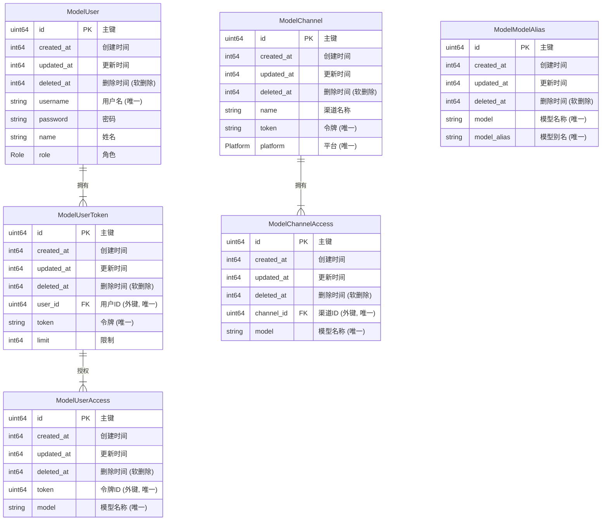

# AI Load 数据库设计

本文档定义了 `AI Load` 项目的数据库结构。

## 🧬 Mermaid ERD 关系图

此 **实体关系图 (ERD)** 清晰地展示了各个数据模型之间的结构与关联，助您一目了然地把握整个系统的核心数据架构。

## 📜 Protobuf Message 详细定义

下方是将每个 `message` 结构化的 **Markdown 表格**，其中包含了字段名、类型、编号以及从注释中提取的 **GORM 数据库约束** 等关键信息。

### [`ModelChannel`](aiload.proto:129)

| 字段名       | 字段类型   | 字段编号 | 备注                                                      |
| :----------- | :--------- | :------- | :-------------------------------------------------------- |
| `id`         | `uint64`   | 1        | 主键                                                      |
| `created_at` | `int64`    | 2        | 创建时间                                                  |
| `updated_at` | `int64`    | 3        | 更新时间                                                  |
| `deleted_at` | `int64`    | 4        | `@gorm: index: idx_channel,unique` (软删除标记，唯一索引) |
| `name`       | `string`   | 5        | 渠道名称                                                  |
| `token`      | `string`   | 6        | `@gorm: index: idx_channel,unique` (唯一索引)             |
| `platform`   | `Platform` | 7        | `@gorm: index: idx_channel,unique` (唯一索引)             |

### [`ModelChannelAccess`](aiload.proto:143)

| 字段名       | 字段类型 | 字段编号 | 备注                                                             |
| :----------- | :------- | :------- | :--------------------------------------------------------------- |
| `id`         | `uint64` | 1        | 主键                                                             |
| `created_at` | `int64`  | 2        | 创建时间                                                         |
| `updated_at` | `int64`  | 3        | 更新时间                                                         |
| `deleted_at` | `int64`  | 4        | `@gorm: index: idx_channel_access,unique` (软删除标记，唯一索引) |
| `channel_id` | `uint64` | 5        | `@gorm: index: idx_channel_access,unique` (外键，唯一索引)       |
| `model`      | `string` | 6        | `@gorm: index: idx_channel_access,unique` (唯一索引)             |

### [`ModelModelAlias`](aiload.proto:156)

| 字段名        | 字段类型 | 字段编号 | 备注                                                   |
| :------------ | :------- | :------- | :----------------------------------------------------- |
| `id`          | `uint64` | 1        | 主键                                                   |
| `created_at`  | `int64`  | 2        | 创建时间                                               |
| `updated_at`  | `int64`  | 3        | 更新时间                                               |
| `deleted_at`  | `int64`  | 4        | `@gorm: index:idx_alias,unique` (软删除标记，唯一索引) |
| `model`       | `string` | 5        | `@gorm: index:idx_alias,unique` (唯一索引)             |
| `model_alias` | `string` | 6        | `@gorm: index:idx_alias,unique` (唯一索引)             |

### [`ModelUser`](aiload.proto:170)

| 字段名       | 字段类型 | 字段编号 | 备注                                                  |
| :----------- | :------- | :------- | :---------------------------------------------------- |
| `id`         | `uint64` | 1        | 主键                                                  |
| `created_at` | `int64`  | 2        | 创建时间                                              |
| `updated_at` | `int64`  | 3        | 更新时间                                              |
| `deleted_at` | `int64`  | 4        | `@gorm: index:idx_user,unique` (软删除标记，唯一索引) |
| `username`   | `string` | 5        | `@gorm: index:idx_user,unique` (唯一索引)             |
| `password`   | `string` | 6        | 密码                                                  |
| `name`       | `string` | 7        | 姓名                                                  |
| `role`       | `Role`   | 8        | 内嵌枚举 `Role { Nil = 0; Admin = 1; User = 2; }`     |

### [`ModelUserToken`](aiload.proto:191)

| 字段名       | 字段类型 | 字段编号 | 备注                                                   |
| :----------- | :------- | :------- | :----------------------------------------------------- |
| `id`         | `uint64` | 1        | 主键                                                   |
| `created_at` | `int64`  | 2        | 创建时间                                               |
| `updated_at` | `int64`  | 3        | 更新时间                                               |
| `deleted_at` | `int64`  | 4        | `@gorm: index:idx_token,unique` (软删除标记，唯一索引) |
| `user_id`    | `uint64` | 5        | `@gorm: index:idx_token,unique` (外键，唯一索引)       |
| `token`      | `string` | 6        | `@gorm: index:idx_token,unique` (唯一索引)             |
| `limit`      | `int64`  | 7        | 限制                                                   |

### [`ModelUserAccess`](aiload.proto:206)

| 字段名       | 字段类型 | 字段编号 | 备注                                                                                 |
| :----------- | :------- | :------- | :----------------------------------------------------------------------------------- |
| `id`         | `uint64` | 1        | 主键                                                                                 |
| `created_at` | `int64`  | 2        | 创建时间                                                                             |
| `updated_at` | `int64`  | 3        | 更新时间                                                                             |
| `deleted_at` | `int64`  | 4        | `@gorm: index:idx_user_access,unique` (软删除标记，唯一索引)                         |
| `token`      | `uint64` | 5        | `@gorm: index:idx_user_access,unique` (外键，唯一索引)，推测关联 `ModelUserToken.id` |
| `model`      | `string` | 6        | `@gorm: index:idx_user_access,unique` (唯一索引)                                     |
