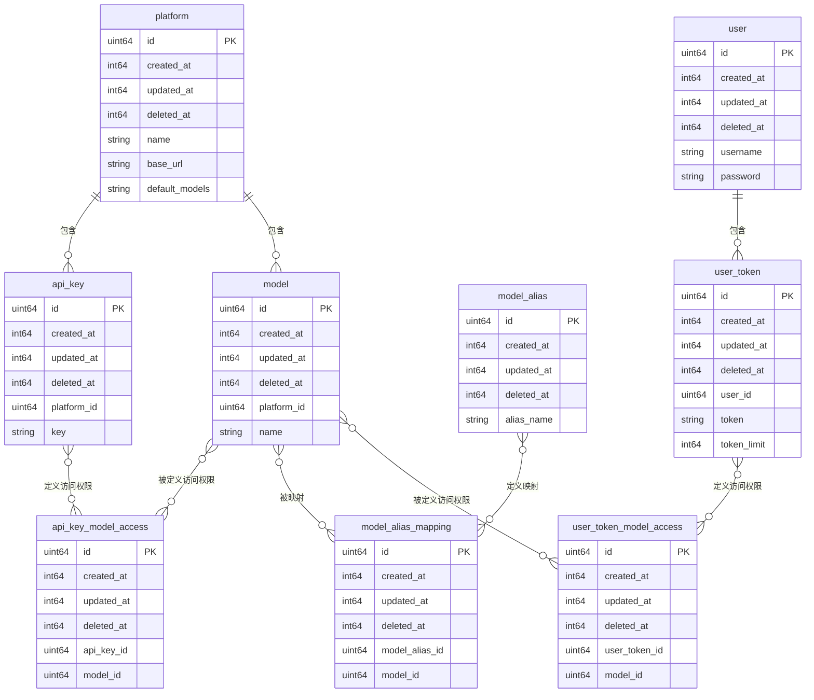

# AI Load 数据库设计

本 文档定义了 `AI Load` 项目的数据库结构。

## 关系图 (ERD)

## 核心实体与关系

### 1. platform

`platform` 表存储了支持的第三方 AI 平台信息。

| 字段             | 类型     | 描述                           | 默认值   | 数据库兼容性说明                                                               |
| ---------------- | -------- | ------------------------------ | -------- | ------------------------------------------------------------------------------ |
| `id`             | `uint64` | **主键**，唯一标识             | 自增     | `BIGINT UNSIGNED` (MySQL), `BIGINT` (PostgreSQL, 注意范围), `INTEGER` (SQLite) |
| `created_at`     | `int64`  | 创建时间 (Unix timestamp)      | 当前时间 | `BIGINT` (MySQL/PostgreSQL), `INTEGER` (SQLite)                                |
| `updated_at`     | `int64`  | 更新时间 (Unix timestamp)      | 当前时间 | `BIGINT` (MySQL/PostgreSQL), `INTEGER` (SQLite)                                |
| `deleted_at`     | `int64`  | 软删除时间 (Unix timestamp)    | `0`      | `BIGINT` (MySQL/PostgreSQL), `INTEGER` (SQLite)                                |
| `name`           | `string` | 平台名称，如 `OpenAI`, `Azure` | `''`     | `VARCHAR(255)` (MySQL/PostgreSQL), `TEXT` (SQLite)                             |
| `base_url`       | `string` | 平台 API 的基础 URL            | `''`     | `VARCHAR(255)` (MySQL/PostgreSQL), `TEXT` (SQLite)                             |
| `default_models` | `string` | 平台默认支持的模型列表         | `''`     | `TEXT` (MySQL/PostgreSQL/SQLite)                                               |

### 2. api_key

`api_key` 表存储了用于访问第三方平台的 API 密钥。

| 字段          | 类型     | 描述                        | 默认值   | 数据库兼容性说明                                                               |
| ------------- | -------- | --------------------------- | -------- | ------------------------------------------------------------------------------ |
| `id`          | `uint64` | **主键**，唯一标识          | 自增     | `BIGINT UNSIGNED` (MySQL), `BIGINT` (PostgreSQL, 注意范围), `INTEGER` (SQLite) |
| `created_at`  | `int64`  | 创建时间 (Unix timestamp)   | 当前时间 | `BIGINT` (MySQL/PostgreSQL), `INTEGER` (SQLite)                                |
| `updated_at`  | `int64`  | 更新时间 (Unix timestamp)   | 当前时间 | `BIGINT` (MySQL/PostgreSQL), `INTEGER` (SQLite)                                |
| `deleted_at`  | `int64`  | 软删除时间 (Unix timestamp) | `0`      | `BIGINT` (MySQL/PostgreSQL), `INTEGER` (SQLite)                                |
| `platform_id` | `uint64` | 逻辑关联 `platform.id`      | `0`      | `BIGINT UNSIGNED` (MySQL), `BIGINT` (PostgreSQL), `INTEGER` (SQLite)           |
| `key`         | `string` | API 密钥                    | `''`     | `VARCHAR(255)` (MySQL/PostgreSQL), `TEXT` (SQLite)                             |

### 3. model

`model` 表存储了平台提供的具体 AI 模型。

| 字段          | 类型     | 描述                        | 默认值   | 数据库兼容性说明                                                               |
| ------------- | -------- | --------------------------- | -------- | ------------------------------------------------------------------------------ |
| `id`          | `uint64` | **主键**，唯一标识          | 自增     | `BIGINT UNSIGNED` (MySQL), `BIGINT` (PostgreSQL, 注意范围), `INTEGER` (SQLite) |
| `created_at`  | `int64`  | 创建时间 (Unix timestamp)   | 当前时间 | `BIGINT` (MySQL/PostgreSQL), `INTEGER` (SQLite)                                |
| `updated_at`  | `int64`  | 更新时间 (Unix timestamp)   | 当前时间 | `BIGINT` (MySQL/PostgreSQL), `INTEGER` (SQLite)                                |
| `deleted_at`  | `int64`  | 软删除时间 (Unix timestamp) | `0`      | `BIGINT` (MySQL/PostgreSQL), `INTEGER` (SQLite)                                |
| `platform_id` | `uint64` | 逻辑关联 `platform.id`      | `0`      | `BIGINT UNSIGNED` (MySQL), `BIGINT` (PostgreSQL), `INTEGER` (SQLite)           |
| `name`        | `string` | 模型名称, 如 `gpt-4-turbo`  | `''`     | `VARCHAR(255)` (MySQL/PostgreSQL), `TEXT` (SQLite)                             |

### 4. model_alias

`model_alias` 表用于为模型创建别名。

| 字段         | 类型     | 描述                        | 默认值   | 数据库兼容性说明                                                               |
| ------------ | -------- | --------------------------- | -------- | ------------------------------------------------------------------------------ |
| `id`         | `uint64` | **主键**，唯一标识          | 自增     | `BIGINT UNSIGNED` (MySQL), `BIGINT` (PostgreSQL, 注意范围), `INTEGER` (SQLite) |
| `created_at` | `int64`  | 创建时间 (Unix timestamp)   | 当前时间 | `BIGINT` (MySQL/PostgreSQL), `INTEGER` (SQLite)                                |
| `updated_at` | `int64`  | 更新时间 (Unix timestamp)   | 当前时间 | `BIGINT` (MySQL/PostgreSQL), `INTEGER` (SQLite)                                |
| `deleted_at` | `int64`  | 软删除时间 (Unix timestamp) | `0`      | `BIGINT` (MySQL/PostgreSQL), `INTEGER` (SQLite)                                |
| `alias_name` | `string` | 模型的别名, 如 `gpt-4`      | `''`     | `VARCHAR(255)` (MySQL/PostgreSQL), `TEXT` (SQLite)                             |

### 5. user

`user` 表存储了应用的用户信息。

| 字段         | 类型     | 描述                        | 默认值   | 数据库兼容性说明                                                               |
| ------------ | -------- | --------------------------- | -------- | ------------------------------------------------------------------------------ |
| `id`         | `uint64` | **主键**，唯一标识          | 自增     | `BIGINT UNSIGNED` (MySQL), `BIGINT` (PostgreSQL, 注意范围), `INTEGER` (SQLite) |
| `created_at` | `int64`  | 创建时间 (Unix timestamp)   | 当前时间 | `BIGINT` (MySQL/PostgreSQL), `INTEGER` (SQLite)                                |
| `updated_at` | `int64`  | 更新时间 (Unix timestamp)   | 当前时间 | `BIGINT` (MySQL/PostgreSQL), `INTEGER` (SQLite)                                |
| `deleted_at` | `int64`  | 软删除时间 (Unix timestamp) | `0`      | `BIGINT` (MySQL/PostgreSQL), `INTEGER` (SQLite)                                |
| `username`   | `string` | 用户名                      | `''`     | `VARCHAR(255)` (MySQL/PostgreSQL), `TEXT` (SQLite)                             |
| `password`   | `string` | 哈希后的密码                | `''`     | `VARCHAR(255)` (MySQL/PostgreSQL), `TEXT` (SQLite)                             |

### 6. user_token

`user_token` 表存储了用户的访问令牌。

| 字段          | 类型     | 描述                        | 默认值   | 数据库兼容性说明                                                               |
| ------------- | -------- | --------------------------- | -------- | ------------------------------------------------------------------------------ |
| `id`          | `uint64` | **主键**，唯一标识          | 自增     | `BIGINT UNSIGNED` (MySQL), `BIGINT` (PostgreSQL, 注意范围), `INTEGER` (SQLite) |
| `created_at`  | `int64`  | 创建时间 (Unix timestamp)   | 当前时间 | `BIGINT` (MySQL/PostgreSQL), `INTEGER` (SQLite)                                |
| `updated_at`  | `int64`  | 更新时间 (Unix timestamp)   | 当前时间 | `BIGINT` (MySQL/PostgreSQL), `INTEGER` (SQLite)                                |
| `deleted_at`  | `int64`  | 软删除时间 (Unix timestamp) | `0`      | `BIGINT` (MySQL/PostgreSQL), `INTEGER` (SQLite)                                |
| `user_id`     | `uint64` | 逻辑关联 `user.id`          | `0`      | `BIGINT UNSIGNED` (MySQL), `BIGINT` (PostgreSQL), `INTEGER` (SQLite)           |
| `token`       | `string` | 访问令牌                    | `''`     | `VARCHAR(255)` (MySQL/PostgreSQL), `TEXT` (SQLite)                             |
| `token_limit` | `int64`  | 令牌的总可用额度            | `0`      | `BIGINT` (MySQL/PostgreSQL), `INTEGER` (SQLite)                                |

## 关联关系表

### 7. api_key_model_access

`api_key_model_access` 是 `api_key` 和 `model` 之间的多对多关系表。

| 字段         | 类型     | 描述                        | 默认值   | 数据库兼容性说明                                                               |
| ------------ | -------- | --------------------------- | -------- | ------------------------------------------------------------------------------ |
| `id`         | `uint64` | **主键**，唯一标识          | 自增     | `BIGINT UNSIGNED` (MySQL), `BIGINT` (PostgreSQL, 注意范围), `INTEGER` (SQLite) |
| `created_at` | `int64`  | 创建时间 (Unix timestamp)   | 当前时间 | `BIGINT` (MySQL/PostgreSQL), `INTEGER` (SQLite)                                |
| `updated_at` | `int64`  | 更新时间 (Unix timestamp)   | 当前时间 | `BIGINT` (MySQL/PostgreSQL), `INTEGER` (SQLite)                                |
| `deleted_at` | `int64`  | 软删除时间 (Unix timestamp) | `0`      | `BIGINT` (MySQL/PostgreSQL), `INTEGER` (SQLite)                                |
| `api_key_id` | `uint64` | 逻辑关联 `api_key.id`       | `0`      | `BIGINT UNSIGNED` (MySQL), `BIGINT` (PostgreSQL), `INTEGER` (SQLite)           |
| `model_id`   | `uint64` | 逻辑关联 `model.id`         | `0`      | `BIGINT UNSIGNED` (MySQL), `BIGINT` (PostgreSQL), `INTEGER` (SQLite)           |

### 8. model_alias_mapping

`model_alias_mapping` 是 `model_alias` 和 `model` 之间的多对多关系表。

| 字段             | 类型     | 描述                        | 默认值   | 数据库兼容性说明                                                               |
| ---------------- | -------- | --------------------------- | -------- | ------------------------------------------------------------------------------ |
| `id`             | `uint64` | **主键**，唯一标识          | 自增     | `BIGINT UNSIGNED` (MySQL), `BIGINT` (PostgreSQL, 注意范围), `INTEGER` (SQLite) |
| `created_at`     | `int64`  | 创建时间 (Unix timestamp)   | 当前时间 | `BIGINT` (MySQL/PostgreSQL), `INTEGER` (SQLite)                                |
| `updated_at`     | `int64`  | 更新时间 (Unix timestamp)   | 当前时间 | `BIGINT` (MySQL/PostgreSQL), `INTEGER` (SQLite)                                |
| `deleted_at`     | `int64`  | 软删除时间 (Unix timestamp) | `0`      | `BIGINT` (MySQL/PostgreSQL), `INTEGER` (SQLite)                                |
| `model_alias_id` | `uint64` | 逻辑关联 `model_alias.id`   | `0`      | `BIGINT UNSIGNED` (MySQL), `BIGINT` (PostgreSQL), `INTEGER` (SQLite)           |
| `model_id`       | `uint64` | 逻辑关联 `model.id`         | `0`      | `BIGINT UNSIGNED` (MySQL), `BIGINT` (PostgreSQL), `INTEGER` (SQLite)           |

### 9. user_token_model_access

`user_token_model_access` 是 `user_token` 和 `model` 之间的多对多关系表。

| 字段            | 类型     | 描述                        | 默认值   | 数据库兼容性说明                                                               |
| --------------- | -------- | --------------------------- | -------- | ------------------------------------------------------------------------------ |
| `id`            | `uint64` | **主键**，唯一标识          | 自增     | `BIGINT UNSIGNED` (MySQL), `BIGINT` (PostgreSQL, 注意范围), `INTEGER` (SQLite) |
| `created_at`    | `int64`  | 创建时间 (Unix timestamp)   | 当前时间 | `BIGINT` (MySQL/PostgreSQL), `INTEGER` (SQLite)                                |
| `updated_at`    | `int64`  | 更新时间 (Unix timestamp)   | 当前时间 | `BIGINT` (MySQL/PostgreSQL), `INTEGER` (SQLite)                                |
| `deleted_at`    | `int64`  | 软删除时间 (Unix timestamp) | `0`      | `BIGINT` (MySQL/PostgreSQL), `INTEGER` (SQLite)                                |
| `user_token_id` | `uint64` | 逻辑关联 `user_token.id`    | `0`      | `BIGINT UNSIGNED` (MySQL), `BIGINT` (PostgreSQL), `INTEGER` (SQLite)           |
| `model_id`      | `uint64` | 逻辑关联 `model.id`         | `0`      | `BIGINT UNSIGNED` (MySQL), `BIGINT` (PostgreSQL), `INTEGER` (SQLite)           |